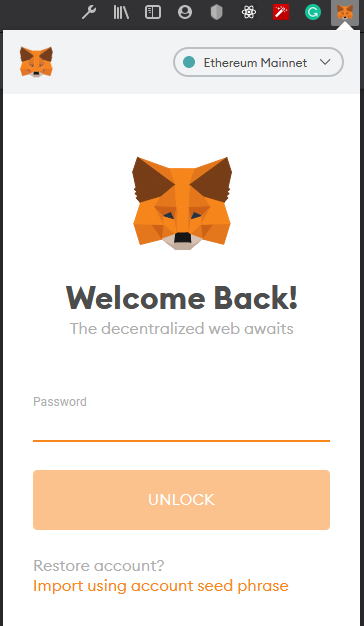
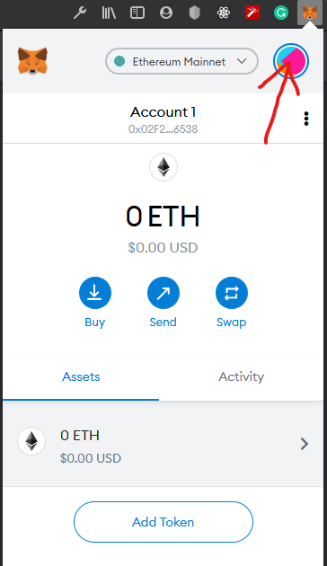
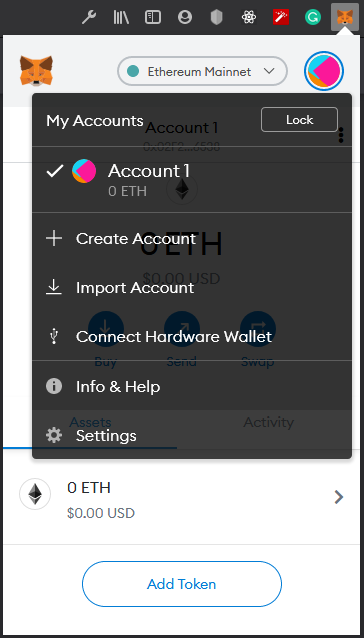
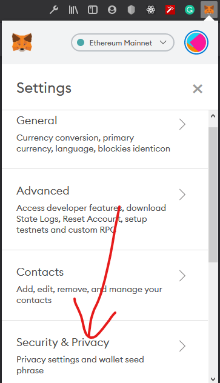
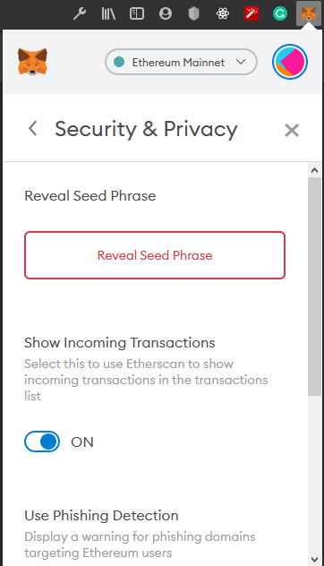

# Getting seed from Metamask 🦊
1. Open your metamask and unlock with password.
<br/>
<br/>

2. Click the accounts icon<br/>
<br/>

3. Go to settings<br/>
<br/>

4. Choose security & privacy<br/>
<br/>

5. Now reveal the seed<br/>
Note: Do not share your seed phrase with anyone<br/>
<br/>

<hr/>

<h2>Loved my work?😀</h2>
1. Don't forget to fork the repo,<br/>
2. Star if you really liked the work. ⭐<br/>
3. Buy me a coffee ☕<br/>

```
ESewa / Khalti / Topup: +9779849092326
Ethereum Mainnet Address: 0x02F24C6cd355646eE0d46Fc8730CcaCB94A76538
0xbb4dAe43487aE815DB0adBb4685D002a07F61db8
```

<hr/>
<h3>Find me on:</h3>
<a target="_blank" href="https://www.facebook.com/sangya.sherpa.2001"> </a>
<a target="_blank" href="https://www.instagram.com/_.sangya._/"> </a>
<a target="_blank" href="https://www.linkedin.com/in/laxman-rai-1bab6518b/"> </a>