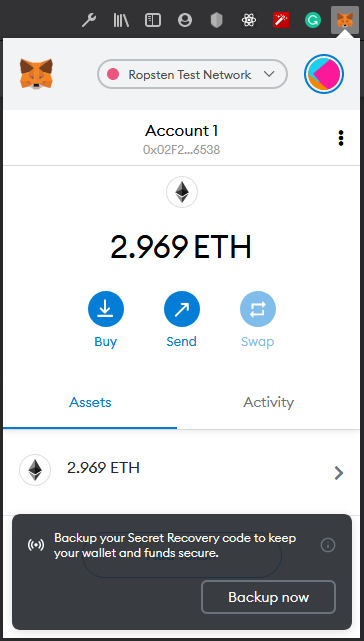
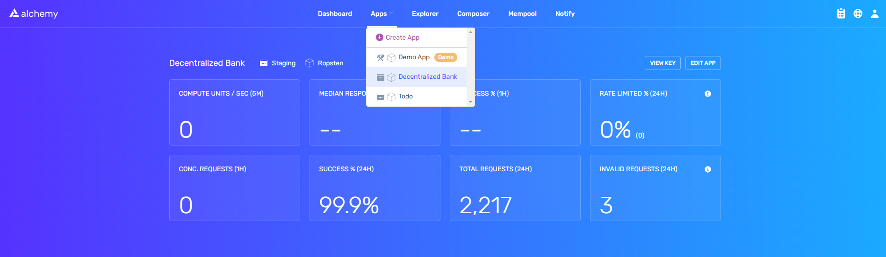
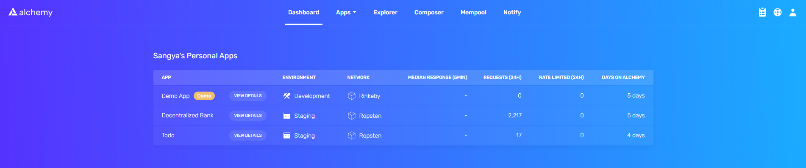
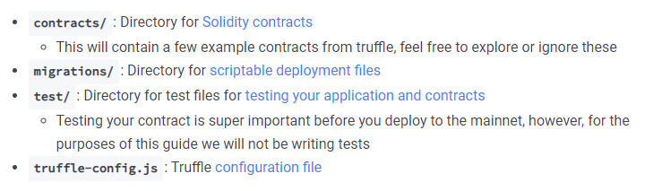

# DApp Development Cheatsheet 📑


<p>
    Hey, a very warm welcome from my side in this decentralized application development cheatsheet.🚀
</p>
<p>
    In this cheatsheet, I'll follow the complete begineer steps to develop, compile, migrate the smart contract and then use it in frontend framework. Finally, we'll deploy our decentralized application to the web.🌐
</p>
<hr/>

### Table of Contents 📑

<h3>Backend Part 💻</h3>

- [Setting Backend API & Metamask](#setting-backend-api-and-metamask)
- [Create an App with Backend API](#create-an-app-with-backend-api)
- [Download Truffle](#download-truffle)
- [Create a Truffle project](#create-a-truffle-project)
- [Install HDWalletProvider](#install-hdwalletProvider)
- [Write your Contract](#write-your-contract)
- [Configure your Project](#configure-your-project)
- [Compile your Smart Contract](#compile-your-smart-contract)
- [Setting migration for contract deployment](#setting-migration)
- [Deploying contract to blockchain "Ropsten Test Network in my case"](#deploy-contract)

<h3>Frontend Part 💪</h3>

- [Install web3](#install-web3)
- [Initializing method to interact with Smart Contract](#initialize-contract-interaction)
- [Calling and Sending method to Interact](#interact-method)

<hr/>

## Backend Part 💻

<h3 id="setting-backend-api-and-metamask">1. Setting Backend API and Metamask 🦊</h3>
<p>
In order for a software and/or application to interact with the blockchain (i.e. read data and/or send transactions to the network), it must connect to an blockchain node. For this purpose, every blockchain client implements the <a target="_blank" href="https://medium.com/@ConsenSys/blockchain-underpinnings-2c43ba03ecc9#:~:text=JSON%2DRPC%20is%20a%20data,commands%20and%20listening%20to%20responses.">JSON-RPC</a> specification. It's bit technical i know but having a surface knowledge really helps.🌊
<br/><br/>
If you want to use a specific programming language to connect with an Ethereum node, roll your own solution <b>but</b> several convenience libraries exist within the ecosystem that make this much easier like really much easier. Here are some lists of <a target="_blank" href="./Documentation/BackendAPI.md">Backend API's</a>.

</p>

<h4>
I've used Alchemy API in this whole project but you can consider any one of the Backend API.💻
</h4>

<ol>
    <li>
        <b>Step 1: Create your Alchemy account</b>
        <p>
        You will need an Alchemy account in order to deploy and make requests to your smart contract. If you don't already have one, you can sign up for free here:<a target="_blank" href="https://dashboard.alchemyapi.io/signup/">https://dashboard.alchemyapi.io/signup/</a>
        </p>
    </li>
    <li>
        <b>Step 2: Create a Metamask Account</b>
        <p>
        Metamask is used to manage your Ethereum account address. When you are creating an account, or if you already have an account, make sure to switch over to the "Ropsten Test Network" in the upper right. You can find the extension for metamask <a target="_blank" href="https://metamask.io/">here.</a><br/><br/>
        
        </p>
    </li>
</ol>

<hr/>

<h3 id="create-an-app-with-backend-api">2. Create an App with Backend API 📱</h3>
<p>
Once you've created an Alchemy account, you can generate an API key by creating an app.🔑
</p>

<ol>
    <li>
        Navigate to the `Create App` page in your Alchemy Dashboard by hovering over `Apps` in the nav bar and clicking `Create App`,
    </li>
    <li>
    Name your app `Your App Name`, offer a short description, select `Staging` for the Environment, and choose `Ropsten` for your network,
    </li>
    <li>
    Click `Create app` and thats it! Your app should appear in the table below<br/><br/>
    
    
    </li>
</ol>

<hr/>

<h3 id="download-truffle">3. Download Truffle 🎯</h3>
<p>
<a target="_blank" href="https://www.trufflesuite.com/docs/truffle/overview">Truffle</a> is a development environment, testing network, and asset pipeline for Ethereum that we will use to build, compile, and deploy our smart contract. To download Truffle, you can install <a target="_blank" href="https://nodejs.org">NodeJS</a> and paste the following command in your terminal:
</p>
<code>npm install -g truffle</code><br/>
Make sure you install Node.js in your system first.😃

<hr/>

<h3 id="create-a-truffle-project">4. Create a Truffle project ✔</h3>

<ol>
<li>
Create a new directory for your Truffle project:<br/>
<code>
mkdir project-name
</code><br/>
<code>
cd project-name
</code>
</li>
<br/>
<li>
Get boilerplate files for creating and deploying smart contracts by "intializing":
<code>truffle init</code><br/>
Once this operation is completed, you'll now have a project structure with the following items:<br/>

</li>
</ol>
<hr/>

<h3 id="install-hdwalletProvider">5. Install HDWalletProvider 👜</h3>
<p>
Truffle HDWallet provider is an easy way to configure network connection to ethereum through a provider like Alchemy, Infura. You can install it using the following command:<br/>
<code>npm install @truffle/hdwallet-provider</code>
</p>

<hr/>

<h3 id="write-your-contract">6. Write your Contract 📑</h3>
<p>
Open up the project folder in your favorite editor. Smart contracts are written in a language called <b>Solidity</b>💻.
</p>

<ol>
<li>
Navigate to the "contracts" folder and create a new file called <code>ContractName.sol</code>. Now that you've created file write your desired contract.
</li>
</ol>

<hr/>

<h3 id="configure-your-project">7. Configure your Project 📐</h3>
<p>
The next step is to edit your <code>truffle-config.js</code> file to use <code>HDWalletProvider</code> and provide all the necessary configuration for deploying to ropsten.
</p>
<ol>
<li>
First, define the <code>HDWalletProvider</code> object in your configuration file. Add this line at the top of your <code>truffle-config.js</code> file:<br/>
<code>const HDWalletProvider = require("@truffle/hdwallet-provider");</code>
</li>
<br/>
<li>
Next, provide a reference to your mnemonic or seed phrase from Metamask. to get your seed reference from Metamask follow these <a target="_blank" href="./Documentation/MetamaskSeedPhrase.md">instructions</a>. Once you have your mnemonic, we recommend storing it safely in an environment file (we will also add our API key here).<br/><br/>
First, install the dotenv package.<br/>
<code>npm install dotenv --save</code><br/><br/>
Next add the following line to your <code>truffle-config.js</code> file.
<br/>
<code>require('dotenv').config()</code><br/><br/>
Then create a <code>.env</code> file at the root directory of your application and add your mnmeonic and Backend API key(In my case Alchemy API) to it:<br/>
<code>API_KEY = "your-backend-api-key"<br/>
MNEMONIC = "your-metamask-seed-reference"</code><br/><br/>
Finally add the new environment variables to our <code>truffle-config.js</code> file:<br/>
<code>const { API_KEY, MNEMONIC } = process.env;</code><br/><br/>
Add the ropsten network to the module.exports in <code>truffle-config.js</code> and your config file must look like this:<br/>
</li>
</ol>

```
const HDWalletProvider = require("@truffle/hdwallet-provider");
require('dotenv').config()

const { API_KEY, MNEMONIC } = process.env;
module.exports = {
    networks: {
        development: {
            host: "localhost",
            port: 8545, // Ganache GUI & CUI uses diff. port i.e. 7545 or 8545
            network_id: "\*", // Match any network id
            gas: 5000000
        },
        ropsten: {
            provider: function () {
                return new HDWalletProvider(MNEMONIC, API_KEY)
            },
            network_id: 3
        }
    },
    compilers: {
        solc: {
            settings: {
                optimizer: {
                enabled: true, // Default: false
                runs: 200 // Default: 200
                },
            }
        }
    }
}
```

<hr/>

<h3 id="compile-your-smart-contract">8. Compile your Smart Contract 💻</h3>
<p>
To compile a Truffle project, navigate to the root of the directory where the project is located and then type the following command:<br/>
<code>
truffle compile
</code>
</p>

<hr/>

<h3 id="setting-migration">9. Setting migration for contract deployment 🚀</h3>
<p>
Navigate to <code>migrations/</code>, then add <code>2_deploy_contracts.js</code> where we'll add the config to deploy the contract.
</p>

```
const YourContract = artifacts.require("YourContract");

module.exports = function (deployer) {
deployer.deploy(YourContract);
};
```

<hr/>

<h3 id="deploy-contract">
10. Deploying contract to blockchain "Ropsten Test Network in my case" 🌊
</h3>
<p>
In order to deploy our smart contract to the Ethereum network, we will use truffle's migrations which are JavaScript files that help you deploy contracts to the Ethereum network.
To run your migrations, run the following:<br/>

<code>truffle migrate --network ropsten</code><br/>
You should then see a response that looks similar to the following:
</p>

```
# Starting migrations...

> Network name: 'ropsten'
> Network id: 3
> Block gas limit: 8000000 (0x7a1200)

# 1_initial_migration.js

Deploying 'Migrations'

---

> transaction hash: 0x61a6c81aaf5be5329c8572ac8de8f9d27064d75f5184f2389f66212b91c9736e
> Blocks: 1 Seconds: 12
> contract address: 0x341662A4BD97bf8542bB0d815F99aff47dB2Fc42
> block number: 8903909
> block timestamp: 1603052580
> account: 0x610Ae88399fc1687FA7530Aac28eC2539c7d6d63
> balance: 4.98766424
> gas used: 168286 (0x2915e)
> gas price: 20 gwei
> value sent: 0 ETH
> total cost: 0.00336572 ETH

> Saving migration to chain.
> Saving artifacts

---

> Total cost: 0.00336572 ETH

# 2_deploy_contracts.js

Deploying 'HelloWorld'

---

> transaction hash: 0x1312f26f70bd444a25790215c56aa4d87a56bc40d141f216df0661ddc3df42bb
> Blocks: 2 Seconds: 32
> contract address: 0x70c86b8d660eBd0adef24E9ACcb389BFb6611B2b
> block number: 8903912
> block timestamp: 1603052602
> account: 0x610Ae88399fc1687FA7530Aac28eC2539c7d6d63
> balance: 4.98206016
> gas used: 237925 (0x3a165)
> gas price: 20 gwei
> value sent: 0 ETH
> total cost: 0.0047585 ETH

> Saving migration to chain.
> Saving artifacts

---

> Total cost: 0.0047585 ETH

# Summary

> Total deployments: 2
> Final cost: 0.00812422 ETH
```
Once this is finished without errors you will have deployed the contract, check it out on <a target="_blank" href="https://ropsten.etherscan.io/">https://ropsten.etherscan.io/</a> by searching for your `transaction hash` or `contract address`!! 🎉

If you head over to your Alchemy dashboard and click on the app details for your app you can see that there are requests flowing through. These requests are made in order to fulfill the deployment of your smart contract.

<hr/>

## Frontend Part 💪

<h3 id="install-web3">1. Install web3 💻</h3>
We need install a web3 package in order to interact with the Ethereum blockchain. We'll be using `Alchemy web3` in this example, however, there are a handful of other `web3 providers` you can choose from.

For the fronend part, I usually use <a target="_blank" href="https://reactjs.org/">React.js</a>. So, initialize the React project in your parent directory by:<br/>
`npx create-react-app app-name`

Now, change the directory to react app by:
`cd app-name`

Now, install the web3 package here by:
`npm install @alch/alchemy-web3 web3`

<hr/>

<h3 id="initialize-contract-interaction">2. Initializing method to interact with Smart Contract 📑</h3>
Hurray, you've made to the almost end of making dapp.🎉

Now, open your `App.js` inside `src/` folder and clear out the unwanted things inside the `<div className="App">`. It should look like:

```
import React from "react"

default function App(){
return <div className="App"></div>
}
```

The following steps are strictly important so follow patiently.
1. Copy the `build/` folder from parent directory then paste inside the `app-name/src/`.
2. Now add the json file in `App.js` by adding line at the top of file:
`import contract from "./build/contracts/YourContract.json";`
3. Import web3 in your `App.js` in top line by:

```
import Web3 from "web3";
import { createAlchemyWeb3 } from "@alch/alchemy-web3";
```
4. Import hook to your app
update `import React from 'react` by `import React, { useState, useEffect } from "react";`
5. Initialize the basic state variables that is required to intialize the method for contract.

```
const [account, setAccount] = useState("");
const [newContract, setNewContract] = useState(null);
const [loading, setLoading] = useState(true);
```

6. Since, Interaction to ethereum blockchain is done through wallet, we need to make sure the wallet is installed in your browser so add the following code inside the function and above the return.

```
async function loadWeb3() {
var { ethereum, web3 } = window;

    if (ethereum) {
      await ethereum.request({ method: "eth_requestAccounts" });
      ethereum.autoRefreshOnNetworkChange = false;
    } else if (web3) {
      web3 = new Web3(web3.currentProvider);
    } else {
      window.alert("Consider using metamask or web3 compatible browser(Mist).");
    }

    // get ethereum accounts
    const accounts = await ethereum.request({ method: "eth_accounts" });
    setAccount(accounts[0]);

}
```

You might see other resources where the wallet are being connected differently, but few things deprecated earlier and soon going to be ended. So this is new and stable way.

7. Fill the empty states with contract and wallet address by adding following code.

```
async function loadBlockchainData() {
// setup contract
const API_KEY =
"add the api key from alchemmy api";
const alchWeb3 = createAlchemyWeb3(API_KEY);

    const contractAddress = "your contract address here where the contract is deployed";
    const ethContract = new alchWeb3.eth.Contract(
      contract.abi,
      contractAddress
    );
    setNewContract(ethContract);

    setLoading(false);

}
```

Things to note here:
1. Never share your API key to anyone so always use `.env` file to store api key and mnemonic code.
2. Add the API in the `API_KEY` above and add contract address which you can find from Etherscan by searching the `tx hash` or your public address by which you deployed the contract.


Finally add the final code to get your base ready for the dapp.

```
useEffect(() => {
(async function fetchData() {
await loadWeb3();
await loadBlockchainData();
})();
}, []);
```

Your final code must look like this

```
import React, { useState, useEffect } from "react";
import Web3 from "web3";
import { createAlchemyWeb3 } from "@alch/alchemy-web3";
import contract from "./build/contracts/YourContract.json";

export default function App() {
const [account, setAccount] = useState("");
const [users, setusers] = useState([]);
const [newContract, setNewContract] = useState(
null
);
const [loading, setLoading] = useState(true);

async function loadWeb3() {
var { ethereum, web3 } = window;

    if (ethereum) {
      await ethereum.request({ method: "eth_requestAccounts" });
      ethereum.autoRefreshOnNetworkChange = false;
    } else if (web3) {
      web3 = new Web3(web3.currentProvider);
    } else {
      window.alert("Consider using metamask or web3 compatible browser(Mist).");
    }

    // get ethereum accounts
    const accounts = await ethereum.request({ method: "eth_accounts" });
    setAccount(accounts[0]);

}

async function loadBlockchainData() {
// setup contract
const API_KEY =
"add the api key from alchemmy api";
const alchWeb3 = createAlchemyWeb3(API_KEY);

    const contractAddress = "your contract address here where the contract is deployed";
    const ethContract = new alchWeb3.eth.Contract(
      contract.abi,
      contractAddress
    );
    setNewContract(ethContract);

    setLoading(false);

}

useEffect(() => {
(async function fetchData() {
await loadWeb3();
await loadBlockchainData();
})();
}, []);

return (
<div className="App"></div>
);
}
```

<hr/>

<h3 id="interact-method">2. Calling and Sending method to Interact 😎</h3>
Sighss, Finally our base has completed it's just a matter of few lines of code to interact with methods.😀

There are two ways to interact with contract through api i.e. call() and send() which is similar to post request and get request in REST API.

1. If I had to retrive something from contract the code would be

```
const getData = async () => {
    setLoading(true);
    const data = await YourContract.methods
      .methodName()
      .call();
    setLoading(false);
    return data;
}
```
where methodName() can be function, variables, numbers but should be public in Smart Contract.

2. If I has to push something to contract the code would be

```
const setData = async (data) => {
    setLoading(true);
    const data = await YourContract.methods
      .methodName(data)
      .send({ from: account });
    setLoading(false);
}
```
Now the metamask will popup saying if you want to confirm or reject the request.

<hr/>

<h2>Loved my work?😀</h2>
1. Don't forget to fork the repo,<br/>
2. Star if you really liked the work. ⭐<br/>


